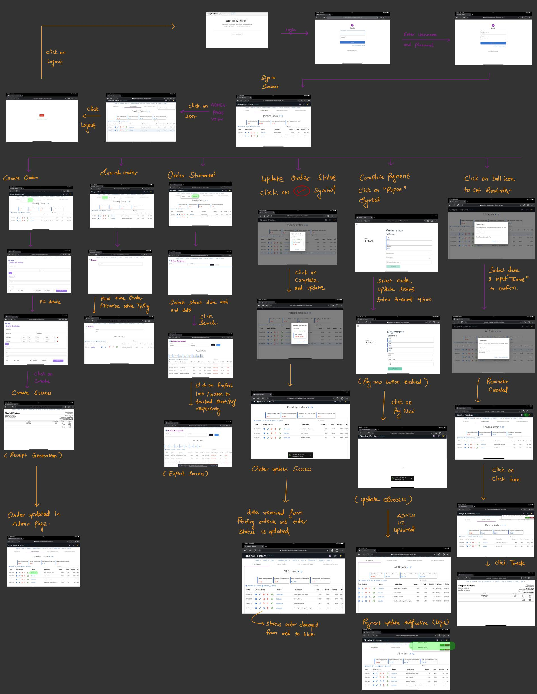
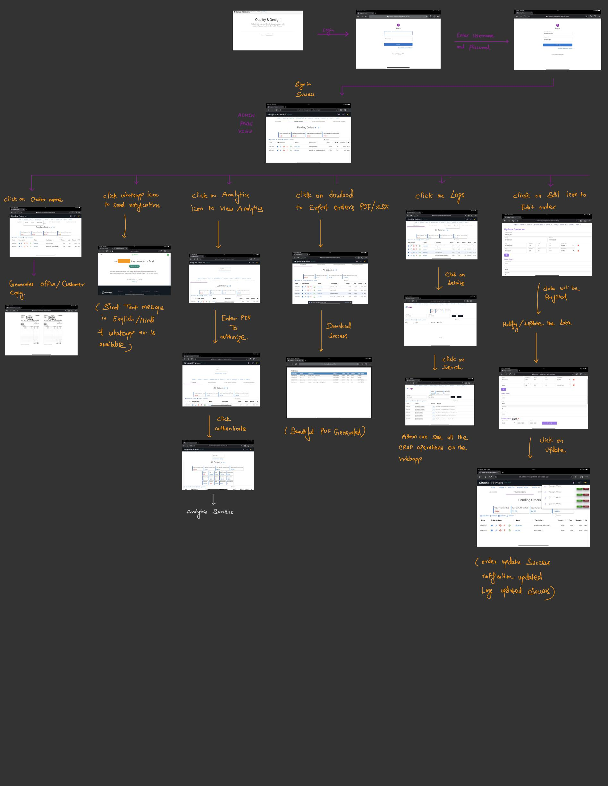

## Business Management Webapp 
Fully Automated Business Management Platform Web application that allows User/Admin to seamlessly handle complexy Accounting, Inventory Management, Payment Notifications, Receipt Generation, Logs etc. 

### Table of Contents

**Technologies**<br>
**Setup**<br>
**Overview**<br>
**Happy Flow**<br>

## Technologies


## Setup  
Make sure you have installed Nodejs if not you can download it from [here](https://nodejs.org/en/download/) and Visual Studio Code from [here](https://code.visualstudio.com/download)

Make sure to have config.env file inside /backend/config/ Diretory.

1. Clone the repository
``` git clone https://github.com/prabalJain1998/singhai-expense-web-app.git ```

2. Open the root directory in vscode
3. Open Terminal.
4. Install Dependencies for Backend by running the command in root directory.
```
npm install
```
5. Install Dependencies for Frontend by running the command in frontend directory.
```
cd frontend
```
```
npm install
```
6. Start the Server by running the command within root directory.
```
npm run dev
```
5. Move to Frontend Directory
```
cd frontend
```
```
npm start
```
6. Remember to add env variables in directory as backend/config/config.env
```
PORT = 3000 
DB_URL = PUT_DATABASE_CONNECTION_STRING
JWT_SECRET = PUT_RANDOM_STRING
JWT_EXPIRE = 5d
COOKIE_EXPIRE = PUT_NUMBER_OF_DAYS_HERE
SMTP_MAIL = YOUREMAIL 
SMTP_PASSWORD = YOURPASSWORD
SECURE_KEY = SOMERANDOMKEY
FRONTEND_URL = "http://localhost:3000"
```
Hurray your Webapp is Up  https://business-management-2cr4jk4cp-coolprabal3-gmailcom.vercel.app/ !!!!!

## Overview

Introducing a stunning web application that I developed as a freelance project for a local printing business. With its beautiful and user-friendly UI, this application offers a wide range of features that are sure to meet the needs of any shop vendor.

Firstly, the application provides seamless communication with customers through WhatsApp notifications, allowing for real-time updates on orders and promotions. Additionally, the payment reminder feature helps to ensure timely payments and reduces the risk of late payments.

The application also boasts robust order management capabilities, including order creation and deletion, account management, inventory management, and budget tracking. The Order Statement feature provides a detailed breakdown of all orders, while the automatic receipt generation makes it easy to track transactions.

For data analysis, the application features a powerful Data Analytics dashboard that allows for deep insights into sales trends and customer behavior. The logger feature also ensures that all transactions and interactions are properly tracked and recorded for future reference.

Finally, this web application offers multiple business management capabilities, making it ideal for shops that manage multiple businesses. All of this is made possible through the use of cutting-edge technologies such as React JS for the frontend, Node JS and Express JS for the backend, and MongoDB for the database. The application is also hosted on Vercel, ensuring fast and reliable performance.


## Happy Flow :



